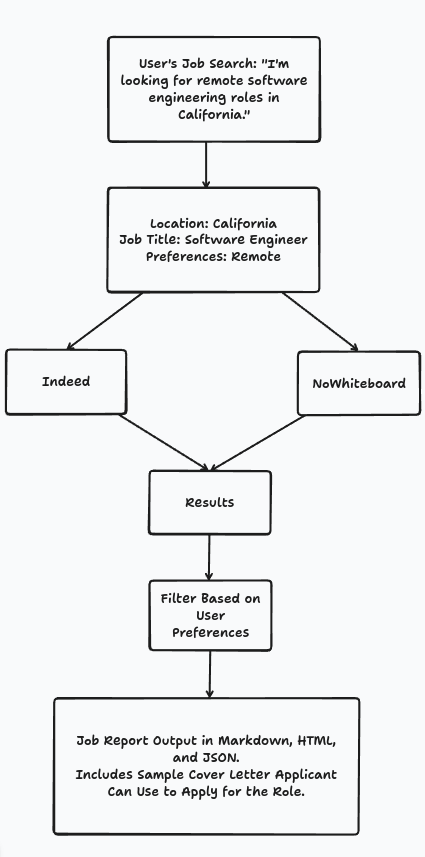
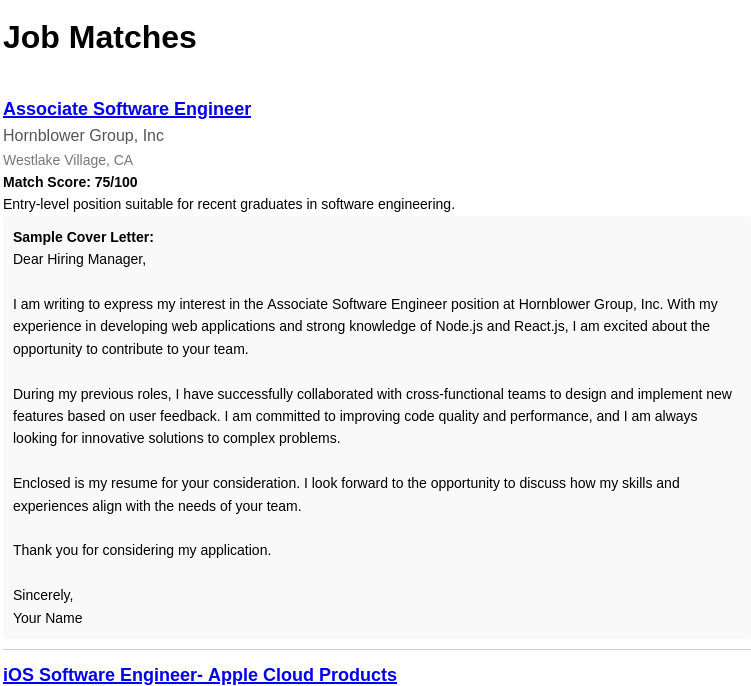

# Job Search AI Agent

## Overview
Job Search AI Agent is an Apify Actor that automates the process of finding job listings based on user-defined preferences. By leveraging OpenAI's GPT capabilities, it analyzes job postings, scores them based on relevance, and even generates tailored cover letters for each opportunity.

## Features
- **Automated Job Searching:** Finds jobs on platforms like Indeed, and NoWhiteboard.
- **AI-Powered Matching:** Uses OpenAI to score job postings based on the provided preferences.
- **Resume Analysis:** Parses a provided resume to improve job recommendations.
- **Custom Cover Letter Generation:** Generates personalized cover letters for each matched job.



## Input Configuration
The actor uses the following input parameters:

```json
{
    "title": "Job Search AI Agent",
    "type": "object",
    "schemaVersion": 1,
    "properties": {
        "jobPreferences": {
            "title": "Job Preferences",
            "type": "string",
            "description": "Your job preferences (i.e. remote, title, location, etc.)",
            "editor": "textfield",
            "prefill": "I'm looking for remote software engineering roles in San Francisco, CA."
        },
        "OPENAI_API_KEY": {
            "title": "OpenAI API Key",
            "type": "string",
            "description": "The API key to use for prompting ChatGPT. You will be charged for usage if you don't supply your own API key.",
            "editor": "textfield"
        },
        "resumePath": {
            "title": "Resume URL Path",
            "type": "string",
            "description": "The URL of the resume to parse.",
            "editor": "textfield"
        },
        "platform": {
            "title": "Platform",
            "type": "string",
            "enum": ["indeed", "nowhiteboard"],
            "description": "Job platform to return.",
            "editor": "select",
            "prefill": "nowhiteboard"
        }
    },
    "required": ["jobPreferences"]
}
```

## Output
### Be sure to check the "Storage > Key-value store output tab for the HTML/MD report files.
The actor returns a list of matched job opportunities, including:
- **Title**
- **Company**
- **Location**
- **Match Score**
- **Reason for match**
- **AI-Generated Cover Letter**

Example output:

```json
[
    {
        "title": "iOS Application Developer - Health Software",
        "company": "Apple",
        "location": "Sunnyvale, CA",
        "match_score": 85,
        "match_reason": "Relevant experience in healthcare and mobile app development aligns with the job requirements for health software development.",
        "sample_cover_letter": "Dear Hiring Manager,\n\nI am writing to express my interest in the iOS Application Developer position at Apple. With extensive experience in mobile application development and a passion for health technology, I am excited about the opportunity to contribute to Apple's Health team. My background in software engineering, coupled with my experience optimizing API responses, aligns perfectly with the requirements of this role. I look forward to the possibility of discussing how I can contribute to your innovative projects.\n\nSincerely,\nJosh Bishop"
    },
    {
        "title": "DevOps Engineer",
        "company": "Capgemini",
        "location": "San Francisco, CA",
        "match_score": 75,
        "match_reason": "Experience in backend development and involvement in continuous integration and delivery can contribute to DevOps responsibilities.",
        "sample_cover_letter": "Dear Hiring Manager,\n\nI am eager to apply for the DevOps Engineer role at Capgemini. My experience leading backend projects and improving operational workflows has equipped me with the skills necessary for this position. I thrive in environments where collaboration and problem-solving are key, and I am excited to bring my expertise to your team.\n\nBest regards,\nJosh Bishop"
    },
    {
        "title": "Software Quality Assurance Engineer - Security",
        "company": "Apple",
        "location": "Cupertino, CA",
        "match_score": 80,
        "match_reason": "Strong background in software development and testing practices matches the requirements for quality assurance roles focused on security.",
        "sample_cover_letter": "Dear Hiring Manager,\n\nI am writing to express my interest in the Software Quality Assurance Engineer position at Apple. With my background in backend development and my experience in ensuring the quality of complex software systems, I am well-prepared to contribute to your team. My focus on best practices in software engineering ensures that I can effectively help maintain the high standards associated with Apple's products.\n\nSincerely,\nJosh Bishop"
    },
    {
        "title": "Software Engineering Manager, Health",
        "company": "Apple",
        "location": "Sunnyvale, CA",
        "match_score": 78,
        "match_reason": "Leadership experience in software development aligns well with the managerial aspect of this role in the health sector.",
        "sample_cover_letter": "Dear Hiring Manager,\n\nI am interested in the Software Engineering Manager position at Apple. With my experience leading teams in high-stakes environments and my passion for health technology, I believe I would excel in this role. I look forward to the opportunity to leverage my skills to further enhance Apple's innovative health solutions.\n\nBest regards,\nJosh Bishop"
    },
    {
        "title": "Software Engineer",
        "company": "Visa",
        "location": "Foster City, CA",
        "match_score": 70,
        "match_reason": "Experience in back-end technologies and software development can contribute to Visa's payment technology projects.",
        "sample_cover_letter": "Dear Hiring Manager,\n\nI am excited to apply for the Software Engineer position at Visa. My extensive experience in software development, combined with my collaborative spirit, makes me a strong candidate for this role. I am eager to contribute to your team and help build innovative payment solutions.\n\nThank you,\nJosh Bishop"
    },
    {
        "title": "Full Stack Engineer",
        "company": "Corelight",
        "location": "San Francisco, CA",
        "match_score": 85,
        "match_reason": "My experience with modern tech stacks and full-cycle development makes me an ideal fit for this role in a cybersecurity context.",
        "sample_cover_letter": "Dear Hiring Manager,\n\nI am writing to express my enthusiasm for the Full Stack Engineer position at Corelight. With a strong foundation in both front-end and back-end development and a passion for cybersecurity, I am excited about the opportunity to contribute to your innovative team. I look forward to discussing how my skills and experiences align with your company's goals.\n\nWarm regards,\nJosh Bishop"
    }
]
```

## Pricing
This actor operates on a **pay-per-event** model:
- **Actor Initialization:** $1 per run
- **Resume Parse:** $0.25 per page
- **Job Result:** $0.05 per result returned

## Usage Instructions
1. Deploy the actor on Apify.
2. Provide the required input parameters.
3. Run the actor to fetch job listings and AI-generated cover letters.
4. Review the output and apply to jobs efficiently.

## Requirements
- Apify account
- OpenAI API key
- Resume hosted at a publicly accessible URL

## Support
For any issues or feature requests, please reach out via the Apify community or GitHub repository.

---
**Note:** This actor relies on third-party job platforms, and availability of job listings may vary based on platform restrictions.
